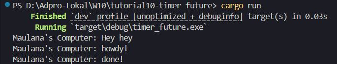

# Eksplanasi Experiment 1.2:

Hasil dari eksperimen tesebut output menampilkan tiga baris output: "Maulana's Computer: Hey hey", "Maulana's Computer: howdy!", dan "Maulana's Computer: done!", dengan jeda selama 2 detik antara dua baris terakhir. Sedangkan sebelumnya sebelum ada line print "Maulana's Computer: Hey hey" jeda selama 2 detik juga terjadi diantara dua baris yang sama.

Hal ini terjadi karena program menggunakan executor untuk menjalankan task asynchronous, di mana spawn digunakan untuk menjadwalkan task yang mencetak "howdy!", lalu menunggu selama 2 detik menggunakan `TimerFuture`, dan kemudian mencetak "done!". Baris "Hey hey" langsung dicetak di `main()` sebelum executor dijalankan, sehingga muncul paling awal tanpa delay.

`TimerFuture` bekerja dengan membuat thread terpisah yang tidur selama 2 detik. Saat `poll()` pertama dipanggil, future belum selesai, jadi executor menyimpan waker dan kembali dalam status Pending. Setelah 2 detik, thread tersebut mengatur flag `completed = true` dan memanggil `waker.wake()`, sehingga task dijadwalkan ulang untuk diproses oleh executor. Ketika task dijalankan kembali, `poll()` mengembalikan Ready, yang menyebabkan baris "done!" dicetak. Mekanisme ini memungkinkan penundaan terjadi secara asynchronous tanpa memblokir thread utama.

