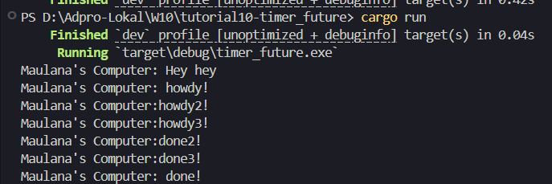
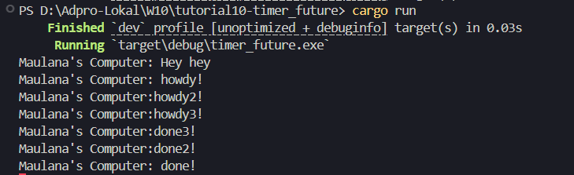

# Eksplanasi Experiment 1.2:

Hasil dari eksperimen tesebut output menampilkan tiga baris output: "Maulana's Computer: Hey hey", "Maulana's Computer: howdy!", dan "Maulana's Computer: done!", dengan jeda selama 2 detik antara dua baris terakhir. Sedangkan sebelumnya sebelum ada line print "Maulana's Computer: Hey hey" jeda selama 2 detik juga terjadi diantara dua baris yang sama.

Hal ini terjadi karena program menggunakan executor untuk menjalankan task asynchronous, di mana spawn digunakan untuk menjadwalkan task yang mencetak "howdy!", lalu menunggu selama 2 detik menggunakan `TimerFuture`, dan kemudian mencetak "done!". Baris "Hey hey" langsung dicetak di `main()` sebelum executor dijalankan, sehingga muncul paling awal tanpa delay.

`TimerFuture` bekerja dengan membuat thread terpisah yang tidur selama 2 detik. Saat `poll()` pertama dipanggil, future belum selesai, jadi executor menyimpan waker dan kembali dalam status Pending. Setelah 2 detik, thread tersebut mengatur flag `completed = true` dan memanggil `waker.wake()`, sehingga task dijadwalkan ulang untuk diproses oleh executor. Ketika task dijalankan kembali, `poll()` mengembalikan Ready, yang menyebabkan baris "done!" dicetak. Mekanisme ini memungkinkan penundaan terjadi secara asynchronous tanpa memblokir thread utama.

---

# Eksplanasi Experiment 1.3:

Dalam program tersebut, tiga task async dijalankan hampir bersamaan oleh executor. Setiap task mencetak "howdy...", lalu menjalankan `TimerFuture::new(Duration::new(2, 0)).await`, yang menyebabkan jeda selama dua detik sebelum mencetak "done...". Karena semua task menggunakan durasi timer yang sama dan executor dijalankan dalam satu thread, task-task tersebut dieksekusi secara bergiliran berdasarkan kapan `waker.wake()` dipanggil oleh thread timer-nya masing-masing. Oleh karena `TimerFuture` menggunakan thread yang berbeda dan waker dijalankan hampir bersamaan setelah 2 detik, urutan done... dari masing-masing task bisa berbeda-beda pada setiap percobaan, meskipun urutan howdy... selalu sama.

Baris `drop(spawner);` sebenarnya berfungsi untuk memberi sinyal kepada executor bahwa tidak akan ada task baru yang akan dikirim ke channel. Saat di-comment, seperti pada kode di atas, executor akan tetap berfungsi normal karena semua task sudah dikirim sebelum `executor.run()` dipanggil. Namun, dalam skenario nyata atau jika executor dijalankan di thread terpisah dan menunggu `recv()`, tidak memanggil `drop(spawner)` dapat menyebabkan executor menunggu selamanya meskipun semua task sudah selesai, karena channel tidak tertutup. Jadi meskipun tidak berdampak langsung dalam contoh ini, `drop(spawner)` tetap penting untuk clean shutdown dan menghindari deadlock pada executor di lingkungan multithread atau produksi.

